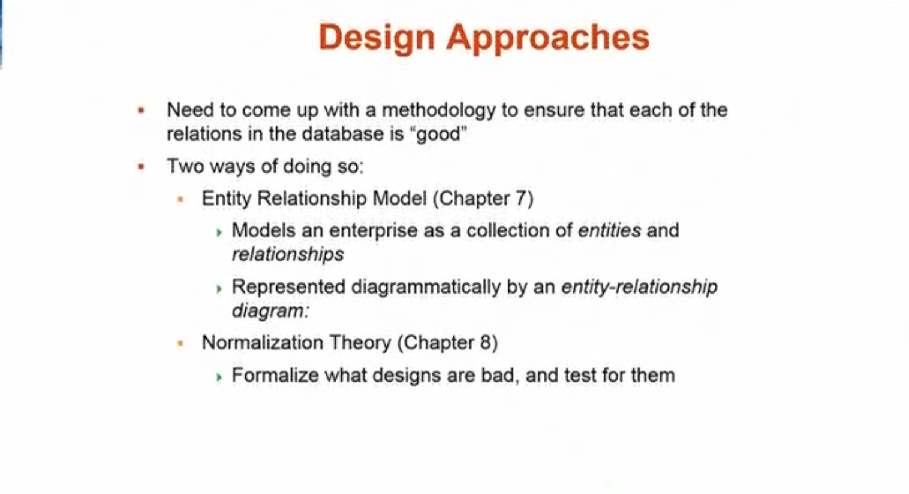

## Design Approaches

## Object Relational Data Models

## XML

## Database Engine
It consists of 3 parts:
- Storage manager
- Query processing
- Transaction manager

### Storage Manager

### Query Processing

### Transaction Management
Since databases deal with persistent, it is high essential to keep the database consistent

## Database Users and Administrators

### Database System Internals

